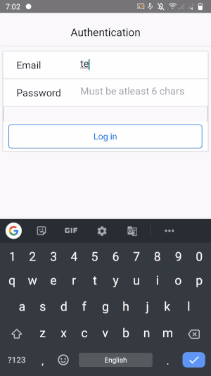

# React-Native Albums App

An app built with Vanilla react-native to authenticate user via firebase.
This app can be used to login/register user using a single multi-purpose screen.
Also the app uses a lot of reusable components that can be used in other projects, feel free to use or contribute more.

## Installation

Clone the repo, setup react-native CLI via pm & run using
```bash
react-native run-android
```

## Working



## Contributing
Pull requests are welcome. For major changes, please open an issue first to discuss what you would like to change.
